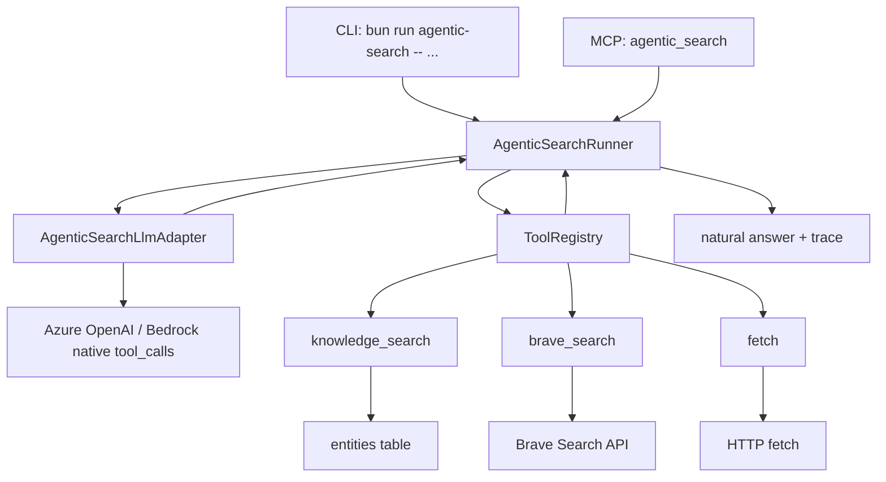

# agentic_search ツールレイヤー再構築計画

## 目的

`agentic_search` を、分類器・候補フィルター・JSON 修復の積み増しではなく、LLM が SystemContext と native tool calling を使って自発的に情報取得する形へ作り直す。

今回の対象は全体フローの一括メンテナンスではない。まず tool レイヤーを完成させ、CLI で実用性を確認してから MCP host に接続する。

## 背景

現行の `agentic_search` は `src/mcp/tools/agentFirst.ts` と `src/services/agentFirst.ts` にまたがっているが、実用面では以下の問題がある。

- `searchKnowledgeV2` は task context を返すだけで、実際の `groups` / `flatTopHits` が空のままになっている。
- `agenticSearch` は `vibe_memories` の raw 類似検索に寄っており、`lesson` / `rule` / `procedure` を tool として明示的に扱えていない。
- MCP handler 側に Web fallback、候補抽出、候補評価、回答不能判定が混ざっている。
- `extractSearchCandidates`, `isCandidateRejection`, `selectAgenticSearchPhrases` のような文字列処理が判断ロジックになっている。
- MCP host 経由でしか見えない問題があり、修正後の確認に host 再起動が必要になりやすい。

`../nipro-template` の chatbot で参考にする点は、ツール選択をプログラム側で決め切るのではなく、SystemContext と tool definition を渡し、LLM の tool call を実行して結果を会話履歴に戻す構造である。

## ドキュメントレビューで解消した実装前ブロッカー

この計画をそのまま実装する前に、以下は曖昧なままだと手戻りになる。

### 1. `tool` role message の扱い

現行の `src/services/review/llm/types.ts` の `ChatMessage` は `system | user | assistant` だけで、OpenAI/Azure OpenAI の `tool` role や `tool_call_id` を表現できない。計画だけで `tool message を追加する` と書いても、そのままでは型と provider adapter が詰まる。

解消方針:

- `agentic_search` 用に `AgenticSearchMessage` を定義する。
- `assistant` message には `toolCalls` または provider raw response を保持できるようにする。
- `tool` message には `toolCallId`, `toolName`, `content` を持たせる。
- `src/services/agenticSearch/llmAdapter.ts` を追加し、Azure OpenAI / Bedrock それぞれの native tool calling message 形式へ変換する。
- 既存 review LLM service を直接無理に流用しない。必要な共通型だけ再利用し、message protocol は agentic_search 側で閉じる。

### 2. 継続判断を JSON やラベルで強制しない

「final answer / continue を選ばせる」と書くと、LLM に JSON や固定ラベルを出させる実装に寄りやすい。これは今回避けたい制御に近い。

解消方針:

- native tool calling の通常プロトコルだけで判断する。
- LLM が `tool_calls` を返した場合は continue。
- LLM が `tool_calls` を返さず text を返した場合は final answer。
- 空 text かつ tool call なしの場合だけ degraded result として返す。

### 3. `knowledge_search` が embedding 依存だけだと初期 smoke が不安定

`entities.embedding` は nullable であり、embedding command や未埋め込みデータに依存すると CLI 検証で 0 件または degraded だけになりやすい。

解消方針:

- primary path は type 絞り込み + vector search。
- embedding 生成失敗、対象 type の embedding 0 件、または DB が vector search を返せない場合は、同じ type の typed fallback を返す。
- typed fallback は `confidence`, `referenceCount`, `freshness`, `createdAt` の順で並べる。これは LLM の判断制御ではなく、DB 内の該当 type 候補を安定して返すための deterministic retrieval として扱う。
- fallback 使用時は `degraded.code = "EMBEDDING_UNAVAILABLE"` または `VECTOR_SEARCH_UNAVAILABLE` を付ける。

### 4. `knowledge_search` と MCP `search_knowledge` の境界

名前が近いため、MCP primary tool を増やす計画に見える。

解消方針:

- `knowledge_search` は LLM 内部 tool。MCP `tools/list` には出さない。
- MCP primary surface は現行どおり `initial_instructions`, `agentic_search`, `search_knowledge`, `record_task_note`, `review_task`, `doctor` の6件を維持する。
- `search_knowledge` は raw 候補確認用の公開 MCP tool として残す。

### 5. HTML parser 依存が未決定

現行 `package.json` には HTML parser が入っていない。fetch の context 節約を parser 前提にするなら、依存追加まで明記しないと実装時に迷う。

解消方針:

- `cheerio` を追加する。nipro-template の `ToolExecutor.executeFetch()` でも使われており、HTML から text content を取り出す用途に合う。
- `script`, `style`, `template`, `noscript` を落とし、`body` の text を whitespace normalize して返す。
- 正規表現は補助的な機械的整形には使ってよいが、DOM 解析の主経路は `cheerio` に寄せる。

### 6. LLM provider の最小対応範囲

local LLM の文字列 tool call を regex 復元しない方針と、CLI で実用確認したい方針が衝突しやすい。

解消方針:

- 初期実装の実用 smoke は native tool calling 対応の Azure OpenAI / Bedrock を対象にする。
- local LLM は `tool_calls` を OpenAI-compatible に返せるようになってから接続する。
- CLI は provider が native tool calling 非対応の場合、実行開始時に `tool_calling_unsupported` を返す。
- これは hosted 前提への転換ではない。MCP host 再起動なしに検証できる local CLI entrypoint を先に作り、provider は設定で選ぶ。

## `../nipro-template` chatbot からの参照点

今回の参考元は、主に `backend/src/modules/chat/agents/specialized/webSearchAnalystAgent.ts`, `backend/src/modules/chat/mcpContext/webSearchAnalystSystemContext.ts`, `backend/src/modules/chat/agents/shared/toolDefinitions.ts`, `backend/src/modules/chat/tools/toolExecutor.ts` である。

採用する構造:

- `WebSearchAnalystAgent` と同じく、最初の LLM 呼び出しでは system message に SystemContext、user message にユーザー要求だけを渡す。
- chat 機能の SystemContext と同じく、最初に質問を解析し、必要な情報を特定し、使う tool を検討する流れを SystemContext に明記する。
- `toolDefinitions.ts` と同じく、LLM に渡す tool は JSON schema 付きの function definition として定義する。
- `ToolExecutor` と同じく、ツール実体は agent / MCP handler から分離し、検索・fetch・知識検索の実行責務だけを持たせる。
- `WebSearchAnalystAgent` と同じく、LLM が返した native `tool_calls` を順番に実行し、結果を `tool` message として会話履歴に戻して、次の LLM 呼び出しで回答を生成させる。
- tool を使った後は、取得結果をもとに「そのまま回答するか、追加 tool call で調査を続けるか」を LLM に判断させる。
- 初期 SystemContext には全 tool の詳細手順を詰め込まず、tool を実際に使った時点で、その tool の読み方・次行動の考え方を追加 context として渡す。
- tool 実行が失敗した場合も、例外で全体を落とすのではなく、失敗内容を tool result として LLM に戻して最終回答を生成させる。
- SystemContext に検索順序、fetch 判断、回答方針を集中させる。

採用しない構造:

- Conductor による専門エージェント分岐は入れない。今回の domain は `agentic_search` 内の3 tool に限定する。
- nipro-template の chat 機能はマルチエージェント構成だが、Gnosis ではシングルエージェント構成にする。質問解析、tool 選択、tool 実行結果の読み取り、最終回答か継続行動かの判断は、同じ `AgenticSearchRunner` の会話 loop 内で完結させる。
- `dynamic_web_fetch`, `screenshot_capture`, Wiki search, semantic search は初期版に入れない。
- tool call 文字列を正規表現で復元する fallback は入れない。
- 検索結果候補の URL 選択や回答可否判定をプログラム側に持たせない。
- session store や WebSocket streaming UI の仕組みは移植しない。CLI と MCP の共通 Runner に必要な trace だけを持つ。

対応関係:

| nipro-template の要素 | Gnosis での置き換え |
| --- | --- |
| `Web検索アナリスト共通ルール.buildSystemContext()` | `src/services/agenticSearch/systemContext.ts` |
| `WEBSEARCH_ANALYST_TOOLS` | `src/services/agenticSearch/toolRegistry.ts` |
| `ToolExecutor.executeWebSearch()` | `tools/braveSearch.ts` |
| `ToolExecutor.executeFetch()` | `tools/fetch.ts` |
| 内部 Wiki / semantic search | `tools/knowledgeSearch.ts` の `knowledge_search(type)` |
| `processToolCalls()` の再帰的 tool loop | `AgenticSearchRunner.run()` の固定上限 loop |
| WebSocket callback trace | CLI / MCP 共通の `toolTrace` |
| Conductor + specialized agents | 採用しない。単一 `AgenticSearchRunner` が全判断を担う |

## 強制制約

この計画では以下を実装上の制約として扱う。

- プログラムロジックで「この依頼ならこの候補を使う」といったガードレール判定を作らない。
- 正規表現で LLM 出力を解析して tool call を復元しない。
- 正規表現や拒否語リストで回答可否を判定しない。
- LLM 出力を後処理で意味変換しない。
- 正規表現禁止は LLM の動作制御に限る。HTML/CSS/JS 除去、URL 検証補助、ログ整形など、取得データを context 節約のために機械的に整える用途では正規表現を使ってよい。
- tool レイヤーは取得と構造化返却だけに責務を限定する。
- 細かい振る舞い調整は SystemContext の文言で行う。
- MCP handler は CLI で検証済みの service を呼ぶだけにする。

許容する処理は、入力 schema validation、DB query、HTTP request、JSON parse、native tool call の引数取り出し、固定上限回数の loop、実行ログ記録に限る。
ただし、取得データの context 節約処理は tool の責務に含める。これは LLM の判断を制御する処理ではなく、HTML / CSS / JavaScript など不要な入力を LLM に渡さないための前処理である。

## 対象ツールドメイン

LLM に渡す tool は最初は3つだけにする。

### `knowledge_search`

目的: Gnosis 内の再利用知識を取得する。

入力:

- `query`: LLM が作る検索語または自然文
- `type`: `lesson | rule | procedure`
- `limit`: 任意。既定は 5。

出力:

- `items`: `id`, `type`, `title`, `content`, `source`, `score`, `metadata`
- `degraded`: DB や embedding 失敗時だけ付与

実装方針:

- `entities` を主対象にする。`lesson`, `procedure`, `rule` を type で絞る。
- `rule` は現行 DB の `constraint` も保存されているため、DB query の対応だけ service 内で吸収する。ただし LLM には `rule` として見せる。
- ベクトル検索が可能な場合は `entities.embedding` を使う。
- embedding 生成失敗や vector search 不可の場合は、同じ type の typed fallback を返す。fallback は該当 type の候補を `confidence`, `referenceCount`, `freshness`, `createdAt` で安定順に返すだけで、候補採否はしない。
- fallback 使用時は degraded を付けるが、`items` は返す。
- LIKE fallback は検索語による ad hoc 判定になりやすいため初期版では入れない。
- `vibe_memories` raw 検索は初期版の `knowledge_search` には混ぜない。必要なら別 PR で `memory_search` として追加する。

### `brave_search`

目的: 外部 Web の検索結果を取得する。

入力:

- `query`: 検索クエリ
- `count`: 任意。既定は 5。

出力:

- `results`: `title`, `url`, `description`, `publishedAt`, `source`
- `degraded`: API key 不在、HTTP error、timeout 時だけ付与

実装方針:

- Brave Search API の結果を JSON 構造のまま返す。
- DuckDuckGo HTML fallback は初期版では使わない。HTML parsing が tool layer の責務を濁すため。
- 検索結果の選別は LLM に任せる。

### `fetch`

目的: URL の本文を取得する。

入力:

- `url`: 取得対象 URL

出力:

- `url`, `status`, `contentType`, `text`, `truncated`
- `degraded`: HTTP error、timeout、content-type 不一致時だけ付与

実装方針:

- URL の補完、広告判定、サイト種別判定などの独自判断は初期版では行わない。
- `text/html` は HTML / CSS / JavaScript / attributes を LLM context に渡さない。`cheerio` で DOM として読み、`script`, `style`, `template`, `noscript` など実行・装飾用ノードを落としたうえで text content だけを返す。
- HTML から本文テキストを取り出す処理は context 節約のための構造変換として扱う。DOM parser を主経路にし、HTML / CSS / JavaScript の機械的除去や whitespace normalize に正規表現を使うことは許容する。
- サイズ上限で truncate する。要約はしない。
- 最大文字数は既定 12,000 文字とし、`GNOSIS_AGENTIC_FETCH_MAX_CHARS` で上書きできるようにする。
- `r.jina.ai` fallback は初期版では使わない。必要性が CLI 検証で明確になってから SystemContext と tool 追加で扱う。

## 目標アーキテクチャ



責務分担:

- `AgenticSearchRunner`: SystemContext、message loop、native tool call 実行、trace 収集。
- `AgenticSearchRunner` は単一エージェントとして動く。別 agent への委譲や conductor は持たない。
- `AgenticSearchLlmAdapter`: `AgenticSearchMessage` を provider-specific request へ変換し、native tool call response を正規化する。
- `ToolRegistry`: LLM に渡す tool definition と実行関数を保持。
- `knowledge_search` / `brave_search` / `fetch`: データ取得のみ。
- CLI: Runner を直接実行し、answer と trace を表示する。
- MCP handler: CLI と同じ Runner を呼び、MCP content に変換する。

## LLM 実行方針

初期版では native tool calling を前提にする。

- Azure OpenAI / Bedrock の `generateMessagesStructured` を優先して使う。
- local LLM が native `tool_calls` を返せない場合、文字列 tool call を regex で復元する fallback は作らない。
- local LLM を使う場合は、localLlm 側が OpenAI-compatible な `tool_calls` を返せるようになってから接続する。
- tool call 非対応 provider が指定された場合、CLI は `tool_calling_unsupported` を返す。

これは制限ではなく、禁止された文字列解析を避けるための互換境界である。

### message protocol

Runner 内部では review 用 `ChatMessage` をそのまま使わず、以下の agentic_search 専用 message を使う。

```ts
type AgenticSearchMessage =
  | { role: 'system'; content: string }
  | { role: 'user'; content: string }
  | { role: 'assistant'; content: string; toolCalls?: AgenticToolCall[]; raw?: unknown }
  | { role: 'tool'; toolCallId: string; toolName: AgenticSearchToolName; content: string };
```

provider adapter の責務:

- Azure OpenAI では assistant `tool_calls` と `tool` role / `tool_call_id` へ変換する。
- Bedrock では assistant の raw `tool_use` block と user の `tool_result` block へ変換する。
- provider response から `toolCalls`, `text`, `usage`, `raw` を返す。
- provider が tool call を返せない場合は `tool_calling_unsupported` を返す。

## SystemContext 方針

SystemContext は `src/services/agenticSearch/systemContext.ts` に集約する。

SystemContext は一枚の長いプロンプトではなく、nipro-template の chat 機能に合わせて段階化する。

### 初期 SystemContext

最初の LLM 呼び出しで読む context。ここでは tool の詳細手順を詰め込まず、行動原則だけを渡す。

含める内容:

- あなたは単一の agent として動く。別 agent への委譲は行わない。
- まずユーザー質問を解析し、回答に必要な情報の種類を見極める。
- 回答に内部知識が必要なら `knowledge_search` を検討する。
- 最新情報や外部情報が必要なら `brave_search` を検討する。
- 検索結果の snippet だけでは不足する場合は `fetch` を検討する。
- tool を使わずに答えられる場合は、tool を使わずそのまま回答する。
- tool 結果を受け取った後は、回答できるか、追加行動が必要かを判断する。

### tool 利用時 context

tool を実際に呼んだ後、次の LLM 呼び出しで tool result と一緒に渡す context。初期 SystemContext には含めない。

- `knowledge_search` 後:
  - `lesson` は過去の注意点・成功/失敗知見として読む。
  - `rule` は守るべき制約として読む。
  - `procedure` は実行手順・検証手順として読む。
  - 取得した知識で回答できるなら回答し、不足するなら別 type または Web を検討する。
- `brave_search` 後:
  - 結果一覧から、ユーザー質問に答えるために読むべき URL を選ぶ。
  - snippet だけで十分なら回答してよい。
  - 根拠が不足する場合は `fetch` を使う。
- `fetch` 後:
  - 取得本文から回答に必要な事実だけを使う。
  - 取得本文で足りるなら回答する。
  - 足りなければ別 URL の fetch、または追加検索を検討する。

### 継続判断 context

各 tool 実行後の LLM 呼び出しでは、追加行動か最終回答かを native tool calling protocol で自然に選ばせる。

- LLM が `tool_calls` を返した場合は、追加情報取得を続ける。
- LLM が `tool_calls` を返さず本文 text を返した場合は、その text を最終回答にする。
- LLM が空 text かつ tool call なしを返した場合だけ、Runner は degraded result を返す。

JSON や固定ラベルで `final answer` / `continue` を出させる実装はしない。この判断は LLM に委ね、プログラム側は固定上限回数だけ管理し、回答可否や候補採否を判定しない。

含める内容:

- 目的: ユーザー依頼に答えるため、必要な情報を自分で取得する。
- 利用可能 tool: `knowledge_search`, `brave_search`, `fetch`。
- 推奨順序: まず Gnosis knowledge、必要なら Web、検索結果だけで不足する場合は fetch。
- `knowledge_search` の `type` の使い分け:
  - `lesson`: 過去の成功・失敗・注意点
  - `rule`: 守るべき方針・制約
  - `procedure`: 実行手順・検証手順
- 回答方針: 取得した根拠を使って自然文で返す。
- 不足時方針: 不足しているときは追加 tool call を行う。上限内で足りなければ不足を明示する。

SystemContext に寄せる内容:

- 質問の解析手順。
- どの tool を先に使うか。
- 検索語をどう作るか。
- どの URL を fetch するか。
- 最終回答に何を含めるか。
- tool 結果を受けて回答するか、さらに調査するか。

プログラムに入れない内容:

- キーワードによる tool 選択。
- 候補の採否判定。
- 公式サイトらしさの判定。
- 回答不能判定。
- LLM 出力の修復。

## 実装対象ファイル

新規:

- `src/services/agenticSearch/types.ts`
- `src/services/agenticSearch/systemContext.ts`
- `src/services/agenticSearch/toolContext.ts`
- `src/services/agenticSearch/llmAdapter.ts`
- `src/services/agenticSearch/toolRegistry.ts`
- `src/services/agenticSearch/runner.ts`
- `src/services/agenticSearch/tools/knowledgeSearch.ts`
- `src/services/agenticSearch/tools/braveSearch.ts`
- `src/services/agenticSearch/tools/fetch.ts`
- `src/scripts/agentic-search.ts`
- `test/agenticSearch/toolRegistry.test.ts`
- `test/agenticSearch/runner.test.ts`
- `test/agenticSearch/knowledgeSearch.test.ts`
- `test/agenticSearch/webTools.test.ts`
- `test/agenticSearch/llmAdapter.test.ts`

変更:

- `src/mcp/tools/agentFirst.ts`
- `src/services/agentFirst.ts`
- `src/services/review/llm/types.ts`（共通型を拡張する場合のみ。原則は agenticSearch 配下で閉じる）
- `package.json`
- `bun.lock`
- `docs/mcp-tools.md`

削除または縮小候補:

- `src/mcp/tools/agentFirst.ts` 内の `extractSearchCandidates`
- `src/mcp/tools/agentFirst.ts` 内の `isCandidateRejection`
- `src/mcp/tools/agentFirst.ts` 内の Web fallback orchestration
- `src/services/agentFirst.ts` 内の `STOP_WORDS`
- `src/services/agentFirst.ts` 内の `selectAgenticSearchPhrases`
- `src/scripts/webTools.ts` の DuckDuckGo fallback
- `src/scripts/webTools.ts` の HTML 抽出は、LLM 動作制御ではなく context 節約処理として再利用または置き換えを判断する。

削除は初期 PR で一気に行わず、Runner 接続後に未使用化を確認してから行う。

## 実装ステップ

### Step 1: tool layer の型と registry を作る

目的: LLM に渡す tool definition と実行関数を1か所に集約する。

作業:

- `AgenticSearchToolName` を `knowledge_search | brave_search | fetch` に固定する。
- `AgenticSearchMessage`, `AgenticToolCall`, `AgenticToolResult`, `AgenticSearchTrace` を `types.ts` に定義する。
- tool definition は native tool calling 用の JSON schema として定義する。
- `executeToolCall(name, args)` は unknown tool を error result にする。
- tool result は JSON.stringify せず、Runner 内では object として保持する。
- provider に渡す直前だけ、tool result object を JSON 文字列化する。

完了条件:

- tool 名が3つだけであることを unit test で固定する。
- 各 tool の schema に必要な required field がある。
- trace schema が unit test で固定される。

### Step 2: `knowledge_search` を完成させる

目的: `lesson` / `rule` / `procedure` の指定で実データが返る状態にする。

作業:

- `entities` query を実装する。
- `type=rule` は DB 上の `rule` と `constraint` を対象にする。
- `type=lesson` と `type=procedure` は同名 type のみ対象にする。
- embedding query が使える場合は score を返す。
- embedding query が使えない場合は typed fallback で `items` を返し、`degraded` に理由を載せる。
- typed fallback は LIKE / keyword filter を使わず、該当 type を安定順で返す。
- DB error は throw ではなく tool result の `degraded` に載せる。

完了条件:

- fixture DB または mock db で `lesson`, `rule`, `procedure` がそれぞれ返る。
- `rule` 指定で `constraint` も返る。
- 0件は正常 result として返る。
- embedding 失敗時も typed fallback の `items` と degraded code が返る。

### Step 3: `brave_search` を完成させる

目的: Web 検索を構造化 result として返す。

作業:

- `BRAVE_SEARCH_API_KEY` を読む。
- Brave Search API の `web.results` を最小項目に写す。
- API key 不在、timeout、HTTP error を `degraded` で返す。
- HTML fallback は入れない。

完了条件:

- API key 不在時に process が落ちない。
- mock fetch で results が構造化される。
- live smoke は key がある環境だけ実行する。

### Step 4: `fetch` を完成させる

目的: URL から context 節約済みの本文テキストを取得する。

作業:

- `cheerio` を dependency に追加する。
- URL は `URL` constructor で検証する。
- HTML は `cheerio` を使って text content 化し、HTML tag / style / script は返さない。
- 非 HTML は text として取得できる範囲で返す。
- 最大文字数で truncate し、`truncated` を返す。
- retry / fallback / 要約は入れない。

完了条件:

- mock fetch で HTML / text / 404 / timeout を確認する。
- HTML fixture で `script`, `style`, tag markup が出力に含まれないことを確認する。
- 既定上限 12,000 文字と `GNOSIS_AGENTIC_FETCH_MAX_CHARS` override がテストされる。
- LLM 出力や回答可否を正規表現で制御する処理が `fetch` に入っていない。

### Step 5: LLM adapter を作る

目的: Runner が provider 差分に引きずられないようにし、native tool calling の message protocol をここに閉じる。

作業:

- `src/services/agenticSearch/llmAdapter.ts` を追加する。
- Azure OpenAI request では assistant `tool_calls` と `tool` role message を正しく送る。
- Bedrock request では `tool_use` / `tool_result` block を正しく送る。
- provider response を `{ text, toolCalls, usage, raw }` に正規化する。
- provider が native tool calling 非対応なら `tool_calling_unsupported` を返す。

完了条件:

- Azure OpenAI 用 request body snapshot test がある。
- Bedrock 用 request body snapshot test がある。
- tool result 再注入後の2ターン目 request に、前回 assistant tool call と tool result が含まれる。
- 文字列 tool call parsing が adapter に存在しない。

### Step 6: Runner を作る

目的: LLM の native tool call を実行し、結果を messages に戻す最小 loop を作る。

作業:

- `AgenticSearchRunner.run({ userRequest, repoPath, files, changeTypes, technologies, intent })` を実装する。
- 初期 SystemContext を system message に入れる。
- userRequest を user message に入れる。
- `AgenticSearchLlmAdapter.generate()` を呼ぶ。
- tool calls が返ったら registry で実行し、tool result message と tool 利用時 context を追加して次 turn に進む。
- 次 turn では、LLM がそのまま最終回答するか、追加 native tool call を返すかを選ぶ。
- loop 上限は固定値で持つ。初期値は 6。
- 最終回答と trace を返す。

完了条件:

- mock LLM が `knowledge_search` を呼ぶテストが通る。
- mock LLM が `brave_search -> fetch` を呼ぶテストが通る。
- mock LLM が `knowledge_search` 後に追加 `brave_search` を選び、さらに `fetch` 後に最終回答するテストが通る。
- tool call なしで最終回答するテストが通る。
- tool 利用時 context が、該当 tool を使った後にだけ messages に追加される。
- regex parse / 拒否語判定 / JSON repair が Runner に存在しない。

### Step 7: CLI を作る

目的: MCP host を再起動せず同等動作を検証できる入口を作る。

作業:

- `src/scripts/agentic-search.ts` を追加する。
- `package.json` に `agentic-search` script を追加する。
- 入力は `--request`, `--repo`, `--file`, `--change-type`, `--technology`, `--intent`, `--provider`, `--json`。
- 既定 provider は現行 cloud provider 解決に合わせる。
- `--json` では `answer`, `toolTrace`, `degraded`, `usage` を返す。
- 通常出力では answer を先に出し、最後に短い trace を出す。
- native tool calling 非対応 provider では、LLM 呼び出し前に `tool_calling_unsupported` と対応 provider 例を返す。

利用例:

```bash
bun run agentic-search -- --request "agentic_search の改善方針を調べて" --repo /Users/y.noguchi/Code/gnosis --change-type mcp --intent plan
bun run agentic-search -- --request "今日の Brave Search API の仕様を確認して" --json
```

完了条件:

- CLI 単体で `knowledge_search` だけのケースを確認できる。
- CLI 単体で `brave_search` と `fetch` のケースを確認できる。
- provider 設定不足時に、必要な環境変数が分かるエラーを返す。
- MCP host 再起動なしでログと trace を確認できる。

### Step 8: MCP handler を薄く接続する

目的: CLI で検証済みの Runner を `agentic_search` MCP tool から使う。

作業:

- `src/mcp/tools/agentFirst.ts` の `agentic_search` handler を Runner 呼び出しに置き換える。
- handler 内の Web fallback / 候補評価 / 回答不能判定を削除する。
- `search_knowledge` は raw 候補確認用の公開 MCP tool として残す。初期版では内部 tool の `knowledge_search` と統合しない。
- MCP response は Runner の answer を text content にする。
- `--json` 相当の trace は diagnostics が必要な場合だけ JSON content として追加するかを別途判断する。

完了条件:

- `test/mcp/tools/agentFirst.test.ts` が Runner mock 中心に更新される。
- MCP `agentic_search` は自然文 answer を返す。
- MCP handler に regex/filter/LLM 出力修復が残らない。

### Step 9: docs と運用手順を更新する

目的: 使い方と検証手順を現行実装に合わせる。

作業:

- `docs/mcp-tools.md` の `agentic_search` 説明を更新する。
- CLI-first の検証手順を追加する。
- `search_knowledge` と `knowledge_search` の違いを明記する。

完了条件:

- docs が Gemma4 JSON 分類前提を残していない。
- MCP host 再起動前の CLI 検証手順がある。

## 検証計画

unit:

```bash
bun test test/agenticSearch/toolRegistry.test.ts
bun test test/agenticSearch/knowledgeSearch.test.ts
bun test test/agenticSearch/webTools.test.ts
bun test test/agenticSearch/llmAdapter.test.ts
bun test test/agenticSearch/runner.test.ts
```

MCP handler:

```bash
bun test test/mcp/tools/agentFirst.test.ts
bun test test/mcpContract.test.ts test/mcpToolsSnapshot.test.ts
```

CLI smoke:

```bash
bun run agentic-search -- --request "Gnosis の agentic_search 改善で守るべきルールを調べて" --intent plan --change-type mcp --json
bun run agentic-search -- --request "Brave Search API の検索結果から公式ドキュメントを確認して" --intent debug --json
```

host 接続後 smoke:

```bash
bun run doctor
bun test test/mcpStdioIntegration.test.ts
```

成功基準:

- CLI で最終回答が返る。
- `toolTrace` に実行された tool 名、引数、degraded の有無が残る。
- `knowledge_search` が `lesson` / `rule` / `procedure` の各 type で結果を返せる。
- embedding が使えない環境でも、`knowledge_search` は typed fallback で候補を返せる。
- Brave key 不在でも CLI が落ちず、LLM に degraded tool result が渡る。
- fetch 結果に HTML tag / CSS / JavaScript が混入しない。
- adapter snapshot で Azure OpenAI / Bedrock の tool result 再注入 request が固定される。
- MCP host 接続後も CLI と同じ Runner を使う。

## 実装しないこと

初期版では以下を入れない。

- `agentic_search` 専用の分類 prompt。
- `use` / `skip` / `maybe` の JSON 判定。
- JSON repair。
- thought recovery。
- regex による tool call 復元。
- DuckDuckGo fallback。
- `r.jina.ai` fallback。
- Failure Firewall / Golden Path の自動注入。
- `review_task` との統合変更。
- MCP primary tool の増減。

## リスクと扱い

native tool calling 非対応 provider:

- 初期版では明示的に unsupported とする。
- 文字列 tool call emulation は作らない。
- CLI は LLM 呼び出し前に検出し、必要な provider と環境変数を示す。

Brave API key 不在:

- `brave_search` は degraded result を返す。
- LLM は knowledge_search だけで回答するか、不足を明示する。

knowledge 0件:

- 正常 result として `items: []` を返す。
- 次に Web を使うかは LLM に任せる。

embedding / vector search 不可:

- `knowledge_search` は typed fallback の `items` を返す。
- fallback で返したことは `degraded` と `toolTrace` に残す。

fetch の本文品質:

- 初期版では HTML / CSS / JavaScript を context に渡さず、本文テキストだけを返す。
- 必要なら後続 PR で parser 変更または専用 tool 追加を検討する。

provider message protocol drift:

- `llmAdapter.test.ts` の snapshot で Azure OpenAI / Bedrock の request shape を固定する。
- review 用 LLM service の `ChatMessage` 型に無理に乗せず、agentic_search 専用 adapter で protocol 差分を吸収する。

MCP host stale:

- まず CLI で検証する。
- MCP host 反映確認は最後に `doctor` と stdio integration test で行う。

## PR 分割案

1. Tool layer PR: `knowledge_search`, `brave_search`, `fetch`, `cheerio` 追加と unit test。
2. LLM adapter PR: agentic_search 専用 message protocol、Azure OpenAI / Bedrock adapter、snapshot test。
3. Runner/CLI PR: SystemContext, native tool loop, CLI smoke。
4. MCP 接続 PR: `agentic_search` handler の薄型化、MCP tests、docs 更新。
5. Cleanup PR: 未使用になった旧 fallback / parsing / rejection logic の削除。

まずは 1 から 3 を連続して実装し、CLI で「実際に回答が返る」ことを確認してから MCP 接続に進む。
