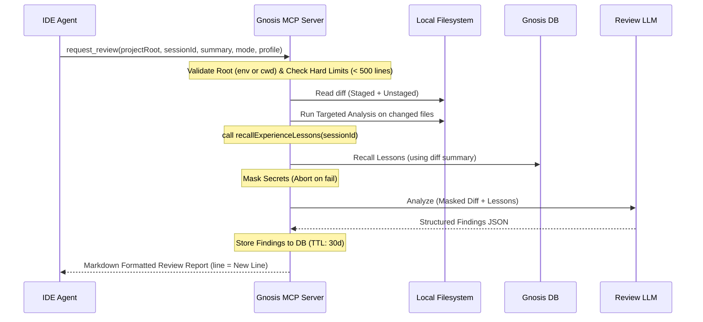

# コードレビューエージェント (Gnosis Code Review Agent) 計画書

本ドキュメントは、Gnosis を基盤とした自律型コードレビューエージェントの、実践的な運用とエッジケースを網羅した最終設計・導入計画です。

---

## 1. 目的とビジョン

### 1.1 目的
IDE 内のエージェント（Cursor, Claude Code 等）の出力を、Gnosis に蓄積された**組織・個人固有の長期記憶（Memory）**と**失敗の教訓（Experience）**でフィルタリングし、最高品質の成果物を保証すること。

### 1.2 背景と課題
- **IDEエージェントの限界**: 文脈制限により、過去に別タスクで発生した「同様の罠」を見逃しやすい。
- **知識の揮発**: 解決されたバグやベストプラクティスが、新しいタスクの際に忘れられてしまう。
- **検証のリスク**: 自動検証における副作用（DB破壊等）や、機密データの外部送信に対する安全策が不足している。

---

## 2. 安全プロトコル (Safety & Trust Boundary)

### 2.1 信頼境界 (Trust Boundary)
- **パス制限の厳格化**: サーバー起動時に環境変数 `GNOSIS_ALLOWED_ROOTS`（カンマ区切り）を設定し、それ以外のアクセスを拒否します。
  - **フォールバック**: 環境変数が未設定の場合、MCP サーバー起動時のカレントディレクトリ（`process.cwd()`）配下のみを暗黙的な許可ルートとしてフェイルセーフを担保します。
- **sessionId の分離**: プロジェクト単位でのナレッジ分離を保証するため、IDE からの明示的な引渡しを必須とします。

### 2.2 コマンド実行 (Command Whitelist & Targeted Analysis)
サプライチェーンリスクを防ぐため、任意のシェル実行は禁止します。
- **ターゲット限定実行**: 全プロジェクトを一括検査するのではなく、抽出された**差分ファイル（変更ファイル群）に対してのみ**個別の静的解析コマンド（例: `npx eslint <changed_files>`）を実行します（モノレポ対策）。
- **縮退運転**: lint 工具自体が未インストールなどの理由で実行失敗した場合でもエラーとせず、「静的解析未実施」として LLM レビューのみを継続します（Graceful Degradation）。

### 2.3 Secret Masking とデータ漏洩防止 (Privacy)
- **マスキングと強制停止**: API key, Bearer 等を検知しプレースホルダー化します。処理エラーなどでマスキングが保証できない場合、**クラウド LLM への送信を即座に強制中止**します。
- **ハードリミット (Overload Protection)**: 差分が **500行を超える場合は即座にエラーを返しレビューを中止**します。これにより、未コミットファイルの肥大化によるタイムアウト、不当な課金、およびマスキング漏れリスクを物理的に遮断します。

---

## 3. システムアーキテクチャ

### 3.1 ワークフロー全体図

---

## 4. MCP ツール仕様 (Handshake API)

### `request_review`

- **Arguments**:
  - `projectRoot` (string, required): プロジェクトの絶対パス。
  - `sessionId` (string, required): 記憶の隔離スコープ。
  - `summary` (string): 実装内容の概要。
  - `mode` (enum): `git_diff`（未追跡を除くStaged+Unstaged）, `worktree`（全ファイル読取）。
  - `profile` (string, optional): LLMプロファイル名。省略時 `mode=worktree` ならローカルへ自動降格。
- **Returns**:
  IDE エージェントがそのままユーザーへ提示できるよう、JSON をパースした**Markdown 文字列**を返却します（背後で DB へは JSON で永続化されます）。
  - 含む情報: `review_id`, 総評, 指摘事項（New File 上の行番号、重要度、適用された教訓の引用付き）。

---

## 5. レポート品質保存と信頼性

### 5.1 構造化出力と幻覚抑制
- **スキーマ検証**: LLM の応答を Zod で厳格に検証し、存在しない行番号への指摘等（幻覚）は自動で除外します。

### 5.2 メタデータの永続化
- **保管ポリシー**: 監査や KPI 計測のため、`findings`（指摘事項 JSON）のみを DB に保存します。マスク後であってもソースコード本体は保存しません。
- **TTL**: 保存から **30日間** で自動削除。

---

## 6. 実装ロードマップ

1. **Phase 1: Foundation**:
   - `GNOSIS_ALLOWED_ROOTS` とフォールバック、500行ハードリミット制約。
   - `SecretMasker` の完全強制停止ロジック。
2. **Phase 2: Core Integration**:
   - 変更ファイル限定のホワイトリスト静的解析。
   - `recallExperienceLessons` を用いたプロンプト注入。
3. **Phase 3: Formatting & Observability**:
   - Zod パースと IDE 向けの Markdown レンダリング。
   - DB 保存 (TTL 30d) と KPI トレース開始。

---

## 7. 計測指標 (KPI)

1. **Findings Adoption Rate**: 指摘を元に実際にコミットされた割合（目標: > 60%）。
2. **Regression Recurrence**: 教訓に存在する問題がマージされた件数（目標: 0）。
   - Gnosis 側で `failureType: RISK_BLOCKING` を持つ同一イベントの発生で計測。
3. **False Positive Rate**: 指摘が無視・意図的に破棄された割合（目標: < 15%）。
