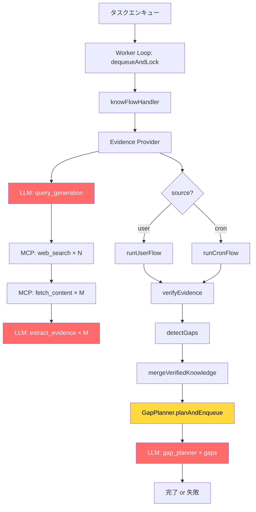
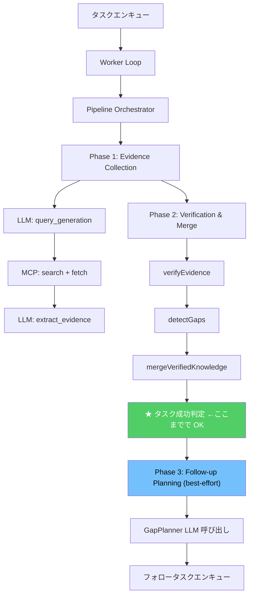

# KnowFlow 抜本的リファクタリング計画書

> **作成日**: 2026-04-19
> **目的**: KnowFlow バックグラウンドワーカーのタスク完了を確実にするための構造的改革

---

## 1. 現状の根本原因分析

### 1.1 直近の障害: 型ミスマッチによるクラッシュ

**症状**: `gaps.filter is not a function` at `knowFlowHandler.ts:351`

```
cronFlow.ts: gaps → number (gaps.gaps.length)
GapPlanner.planAndEnqueue(): gaps → 引数として DetectedGap[] を期待
knowFlowHandler.ts: cronResult.gaps (number) を直接 planAndEnqueue に渡している
```

これは **「小手先の修正」で直る表層バグ** だが、この種のバグが頻発する **構造的な原因** が存在する。

### 1.2 構造的問題の一覧

| # | 問題 | 深刻度 | 影響 |
|---|------|--------|------|
| **S1** | **Flow結果型の不統一** — `cronFlow` と `userFlow` が同じ概念（gaps）に対して異なる型（`number` vs `DetectedGap[]`）を返している | 🔴 致命的 | 型の不整合がランタイムクラッシュの直接原因 |
| **S2** | **Handler の責務過多** — `knowFlowHandler.ts` が「エビデンス取得→フロー実行→メトリクス記録→ギャップ計画→フォロータスクエンキュー」を一枚岩で実行。382行の巨大関数 | 🟡 高 | テスト困難、エラー発生箇所の特定困難、部分的リトライ不可 |
| **S3** | **LLM呼び出しの多重化** — 1タスクの処理中に最大 `5クエリ × 2URL × LLM呼び出し + GapPlanner LLM` = 最大 **13回** の LLM 呼び出し。ローカルLLM のスループット上限を考慮すると1タスクに数十分かかる | 🟡 高 | タイムアウト頻発、リソース枯渇 |
| **S4** | **GapPlanner 内で再度 LLM 呼び出し** — タスクの最終段階で追加の LLM 呼び出しを行うため、ここでの失敗がタスク全体を巻き戻す | 🟡 高 | 90% 完了したタスクが無駄になる |
| **S5** | **degraded 状態の伝搬不足** — `runLlmTask` が degraded フラグを返すが、evidence provider でしかチェックされていない。他の LLM 呼び出し箇所（evidenceExtractor, GapPlanner）では無視される | 🟠 中 | degraded 状態で無意味な処理続行 |
| **S6** | **cronFlow に ExplorationReport がない** — `userFlow` のみが `ExplorationReport` を生成しており、`cronFlow` は gaps 配列を返しもしない | 🟠 中 | cron 経由の実行で GapPlanner が動作不能 |
| **S7** | **二重タイムアウト機構** — `loop.ts` のタイムアウトと `runner.ts` の30分ハードタイムアウトが独立に動作。競合時の挙動が未定義 | 🟠 中 | リソースリーク、ゾンビプロセス |
| **S8** | **テストカバレッジの欠落** — `knowFlowHandler.ts` に対するユニットテストが存在しない。integration テストは handler を mock している | 🟠 中 | 回帰バグの検出不可 |

### 1.3 障害フロー図



---

## 2. リファクタリング戦略

### 2.1 設計原則

1. **型安全な境界** — Flow 間のデータ受け渡しは共通の結果型を通す
2. **段階的コミット** — 各フェーズの成果は中間結果として永続化し、失敗時に途中から再開可能にする
3. **LLM 呼び出しの分離** — GapPlanner の LLM 呼び出しはメインフロー外に切り出し、失敗してもタスク自体は成功とする
4. **テスト駆動** — 各モジュールに対してユニットテストを先に書く

### 2.2 アーキテクチャ After



---

## 3. 具体的な変更計画

### Phase 0: 型安全性の強化（即時修正）

> 目標: ランタイムクラッシュを再発不能にする

#### 3.0.1 共通フロー結果型 `FlowResult` の導入

**[NEW]** `src/services/knowflow/flows/result.ts`

```typescript
import type { DetectedGap } from '../gap/detector';
import type { ExplorationReport } from '../report/explorationReport';

/**
 * cronFlow と userFlow の統一結果型。
 * すべてのフローはこの型を返す。
 */
export type FlowResult = {
  summary: string;
  changed: boolean;
  usedBudget: number;

  // 検証メトリクス
  acceptedClaims: number;
  rejectedClaims: number;
  conflicts: number;

  // ギャップ情報 — 常に DetectedGap[] を返す
  gaps: DetectedGap[];

  // レポート（userFlow の場合のみ）
  report?: ExplorationReport;

  // cronFlow 固有
  runConsumedBudget?: number;
};
```

#### 3.0.2 `cronFlow.ts` の修正

**[MODIFY]** `src/services/knowflow/flows/cronFlow.ts`

- `RunCronFlowResult.gaps` を `number` → `DetectedGap[]` に変更
- `detectGaps` の結果から `gaps.gaps` 配列をそのまま返す

```diff
 export type RunCronFlowResult = {
   summary: string;
   changed: boolean;
   usedBudget: number;
   runConsumedBudget: number;
   acceptedClaims: number;
   rejectedClaims: number;
   conflicts: number;
-  gaps: number;
+  gaps: DetectedGap[];
 };
```

```diff
   return {
     ...
-    gaps: gaps.gaps.length,
+    gaps: gaps.gaps,
   };
```

#### 3.0.3 `userFlow.ts` の修正

**[MODIFY]** `src/services/knowflow/flows/userFlow.ts`

- `RunUserFlowResult.gaps` を `number` → `DetectedGap[]` に変更

```diff
 export type RunUserFlowResult = {
   report: ExplorationReport;
   summary: string;
   changed: boolean;
   acceptedClaims: number;
   rejectedClaims: number;
   conflicts: number;
-  gaps: number;
+  gaps: DetectedGap[];
 };
```

```diff
   return {
     ...
-    gaps: gaps.gaps.length,
+    gaps: gaps.gaps,
   };
```

#### 3.0.4 `knowFlowHandler.ts` のログ修正

**[MODIFY]** `src/services/knowflow/worker/knowFlowHandler.ts`

ログ出力で `gaps` を配列長に変更:

```diff
       logger({
         event: 'task.flow.done',
         ...
-        gaps: cronResult.gaps,
+        gaps: cronResult.gaps.length,
         ...
```

---

### Phase 1: Handler の責務分離

> 目標: 382行の一枚岩を testable なパイプラインに分解する

#### 3.1.1 パイプラインオーケストレーターの導入

**[NEW]** `src/services/knowflow/worker/pipeline.ts`

```typescript
/**
 * KnowFlow タスク実行パイプライン。
 * 各フェーズの責務を明確に分離し、Phase 2 完了時点でタスク成功とする。
 */
export type PipelinePhase =
  | 'evidence_collection'
  | 'verification_and_merge'
  | 'followup_planning';

export type PipelineResult = {
  ok: true;
  summary: string;
  phases: {
    evidenceCollection: { ok: boolean; claimsCount: number; sourcesCount: number };
    verificationAndMerge: { ok: boolean; changed: boolean; gapsCount: number };
    followupPlanning: { ok: boolean; plannedTasks: number; skipped: boolean };
  };
};

export type PipelineContext = {
  task: TopicTask;
  signal?: AbortSignal;
};
```

核心設計:
- **Phase 1 (Evidence Collection)**: LLM + MCP 呼び出し。失敗時はデフォルト/空のエビデンスで Phase 2 へ
- **Phase 2 (Verification & Merge)**: ピュアなロジック。LLM 呼び出しなし。ここまで成功 = タスク成功
- **Phase 3 (Follow-up Planning)**: LLM 呼び出しあり。**best-effort** — 失敗してもタスクは成功扱い

#### 3.1.2 Handler のスリム化

**[MODIFY]** `src/services/knowflow/worker/knowFlowHandler.ts`

- 現在の 382 行の handler 関数を Pipeline の呼び出しに置き換え
- `createKnowFlowTaskHandler` は Pipeline を組み立てるファクトリに変更
- `createMcpEvidenceProvider` はそのまま維持（Phase 1 の部品として利用）

---

### Phase 2: GapPlanner の安全化

> 目標: GapPlanner の失敗がタスク全体を巻き戻さないようにする

#### 3.2.1 GapPlanner を try-catch でラップし best-effort に

**[MODIFY]** `src/services/knowflow/gap/planner.ts`

```typescript
/**
 * best-effort でギャップ計画を実行。
 * LLM 呼び出しが全て失敗しても、ルールベースのフォロータスクを最低限エンキューする。
 */
async planAndEnqueueSafe(
  parentTask: TopicTask,
  gaps: DetectedGap[],
  signal?: AbortSignal,
): Promise<{ plannedTasks: number; hadErrors: boolean }> {
  try {
    const result = await this.planAndEnqueue(parentTask, gaps, signal);
    return { ...result, hadErrors: false };
  } catch (error) {
    // LLM 失敗時はルールベースフォールバック
    return this.fallbackPlan(parentTask, gaps);
  }
}
```

#### 3.2.2 ルールベースフォールバックの追加

LLM が使えなくても、priority >= 0.7 のギャップに対して自動的に `expand` タスクをエンキューする最小限のロジック:

```typescript
private async fallbackPlan(
  parentTask: TopicTask,
  gaps: DetectedGap[],
): Promise<{ plannedTasks: number; hadErrors: boolean }> {
  const critical = gaps.filter(g => g.priority >= 0.7).slice(0, 2);
  let planned = 0;

  for (const gap of critical) {
    await this.options.repository.enqueue({
      topic: parentTask.topic,
      mode: 'expand',
      source: 'cron',
      priority: Math.max(1, Math.floor(parentTask.priority * 0.8)),
    });
    planned++;
  }

  return { plannedTasks: planned, hadErrors: true };
}
```

---

### Phase 3: LLM 呼び出しの堅牢化

> 目標: LLM の不安定さがシステム全体を停止させないようにする

#### 3.3.1 degraded フラグの全面伝播

**[MODIFY]** `src/services/knowflow/ops/evidenceExtractor.ts`

- `extractEvidenceFromText` が degraded 状態を返せるようにする
- degraded 時は空の FlowEvidence を返し、呼び出し元で適切にハンドリング

#### 3.3.2 LLM 呼び出し回数の制限強化

**[MODIFY]** `src/services/knowflow/worker/knowFlowHandler.ts`

現状:
- `MAX_INITIAL_QUERIES = 3`
- `MAX_URLS_PER_QUERY = 2`
- → 最大 3 × 2 = 6 回の `extract_evidence` LLM 呼び出し + 1 回の `query_generation` + GapPlanner

改善:
```typescript
const MAX_TOTAL_LLM_CALLS_PER_TASK = 5; // ハードリミット
```

タスクごとの LLM 呼び出しカウンタを導入し、上限に達したら残りの URL をスキップ。

#### 3.3.3 エビデンス抽出のバッチ化

複数の URL コンテンツを1回の LLM 呼び出しで処理するオプションを追加:

```typescript
// 複数ソースを1プロンプトに結合して呼び出し回数を削減
export const batchExtractEvidence = async (
  inputs: { url: string; text: string }[],
  topic: string,
  ...
): Promise<FlowEvidence> => { ... };
```

---

### Phase 4: テスト基盤の強化

> 目標: リグレッションを自動検出可能にする

#### 3.4.1 knowFlowHandler のユニットテスト

**[NEW]** `src/services/knowflow/worker/knowFlowHandler.test.ts`

テストケース:
1. **正常系**: user/cron の両ソースでタスク完了
2. **型安全性**: cronResult.gaps が DetectedGap[] として GapPlanner に渡されることの検証
3. **degraded 伝播**: LLM が degraded の場合にタスクが graceful に完了
4. **GapPlanner 失敗**: GapPlanner が例外を投げてもタスク自体は成功
5. **タイムアウト**: signal.aborted 時の振る舞い

#### 3.4.2 フロー結果型の型テスト

**[NEW]** `src/services/knowflow/flows/result.test.ts`

```typescript
// コンパイル時の型安全性テスト
import type { FlowResult } from './result';
import type { RunCronFlowResult } from './cronFlow';

// RunCronFlowResult が FlowResult に割り当て可能であることの型テスト
const _typeCheck: FlowResult = {} as RunCronFlowResult;
```

#### 3.4.3 E2E スモークテスト

**[NEW]** `src/services/knowflow/worker/smoke.test.ts`

MockRetriever + stub LLM を組み合わせた end-to-end テスト:
- タスクエンキュー → handler 実行 → DB に done が記録される
- GapPlanner がフォロータスクをエンキューする

---

### Phase 5: 運用改善

> 目標: 問題発生時の診断を迅速化する

#### 3.5.1 構造化ログの強化

各フェーズの開始・終了・所要時間を structured log として出力:

```typescript
logger({
  event: 'pipeline.phase.done',
  phase: 'evidence_collection',
  taskId: task.id,
  durationMs: 12345,
  claimsCount: 5,
  level: 'info',
});
```

#### 3.5.2 二重タイムアウトの統一

- `runner.ts` の 30 分ハードタイムアウトを除去
- `loop.ts` の `taskTimeoutMs` に一元化（config の `knowflow.worker.taskTimeoutMs` で管理）
- AbortSignal ベースの一貫したキャンセル機構を確立

#### 3.5.3 ヘルスチェックエンドポイント

worker の状態（最後に処理したタスク、エラー率、平均処理時間）を JSON で返す MCP ツール / エンドポイントの追加。

---

## 4. 実装優先順位

```
Phase 0 ──┐ 即時 (30分)
           │ 型ミスマッチ修正 + 復旧
           │
Phase 1 ──┤ Day 1 (2-3時間)
           │ Pipeline 分離 + Handler スリム化
           │
Phase 2 ──┤ Day 1 (1時間)
           │ GapPlanner 安全化 + フォールバック
           │
Phase 4 ──┤ Day 1-2 (2時間)
           │ ユニットテスト追加
           │
Phase 3 ──┤ Day 2 (2時間)
           │ LLM 呼び出し堅牢化
           │
Phase 5 ──┘ Day 2-3 (1-2時間)
             運用改善
```

---

## 5. 影響範囲

### 変更ファイル一覧

| 操作 | ファイル | 変更概要 |
|-----|---------|---------|
| **NEW** | `flows/result.ts` | 共通フロー結果型 |
| **MODIFY** | `flows/cronFlow.ts` | gaps: number → DetectedGap[] |
| **MODIFY** | `flows/userFlow.ts` | gaps: number → DetectedGap[] |
| **MODIFY** | `worker/knowFlowHandler.ts` | Pipeline 導入、責務分離 |
| **NEW** | `worker/pipeline.ts` | パイプラインオーケストレーター |
| **MODIFY** | `gap/planner.ts` | planAndEnqueueSafe + fallback |
| **MODIFY** | `ops/evidenceExtractor.ts` | degraded 伝播 |
| **MODIFY** | `background/runner.ts` | 二重タイムアウト除去 |
| **NEW** | `worker/knowFlowHandler.test.ts` | ユニットテスト |
| **NEW** | `worker/smoke.test.ts` | E2E スモークテスト |
| **NEW** | `flows/result.test.ts` | 型テスト |

### 後方互換性

- MCP ツール API: **変更なし**
- Queue Repository API: **変更なし**
- Knowledge Repository API: **変更なし**
- Background Manager: runner.ts のタイムアウト除去のみ

---

## 6. リスクと緩和策

| リスク | 緩和策 |
|-------|--------|
| Pipeline 導入で既存動作が壊れる | Phase 0 の型修正を先にマージし、稼働確認後に Phase 1 に進む |
| フォールバック計画が過剰なタスクを生成 | `maxTasksPerGap` + priority decay で制限済み |
| ローカル LLM のスループット不足は構造変更では解決しない | Phase 3 のバッチ化 + 呼び出し回数制限で影響を最小化 |

---

## 7. 成功基準

1. ✅ `bun test` で全テストが通る
2. ✅ `bun run verify` (lint + typecheck + test) が 0 エラー
3. ✅ MockRetriever + stub LLM で end-to-end スモークテストが通る
4. ✅ 実際の LLM (Gemma 4) でタスクが `done` ステータスまで到達する
5. ✅ GapPlanner の失敗がタスクを `failed` にしない
6. ✅ cronFlow 経由のタスクでフォロータスクが正常にエンキューされる
