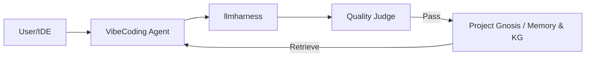

# Project Gnosis: VibeCoding Memory & Knowledge Graph 計画書

## 1. 概要
**Gnosis (グノーシス)** は、AIエージェントに「長期記憶（Vibe Memory）」と「構造化知識（Knowledge Graph）」を付与するためのプロジェクトです。
本機能は、既存の `llmharness` プロジェクトと密接に連携し、信頼性の高い知識蓄積を実現します。

## 2. llmharness との連携アーキテクチャ
`llmharness` は、Gnosis において「脳の検閲・評価機関（前頭前野）」として機能します。

### 役割分担
- **llmharness**: 
    - 抽出された情報の妥当性チェック（Judges）。
    - 記憶の品質スコアリング。
    - LLM アダプター提供。
- **Gnosis (本プロジェクト)**: 
    - PostgreSQL + pgvector + Drizzle ORM による永続化。
    - TypeGraph によるグラフ構造の管理。
    - セマンティック検索の実装。

## 3. 技術スタック
- **Runtime**: Bun
- **Database**: PostgreSQL 16+
- **ORM**: Drizzle ORM (pgvector 対応)
- **Graph**: TypeGraph
- **Extensions**: `pgvector`
- **Interface**: MCP (Model Context Protocol)

## 4. データ構造案 (Drizzle Schema)

### Vibe Memory
- `vibe_memories`: content, embedding (vector), metadata, created_at

### Knowledge Graph
- `entities`: id, name, type, description, metadata
- `relations`: source_id, target_id, relation_type, weight

## 5. ロードマップ

### Phase 0: 立ち上げ
- [ ] `gnosis` ディレクトリ初期化
- [ ] Drizzle + PostgreSQL 接続設定

### Phase 1: 基盤整備
- [ ] `src/db/schema.ts` の実装
- [ ] Embedding 生成アダプターの追加

### Phase 2: Memory & KG エンジン
- [ ] ベクトル検索インターフェース
- [ ] TypeGraph による関係性操作の実装

### Phase 3: IDE 統合
- [ ] MCP サーバーの実装

